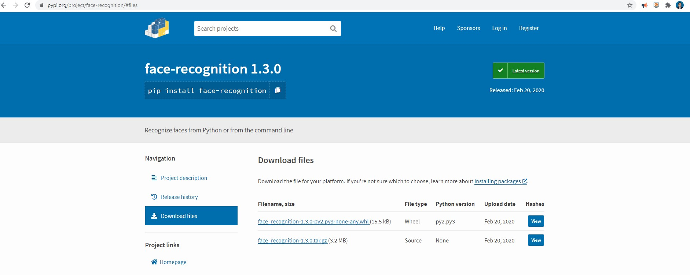
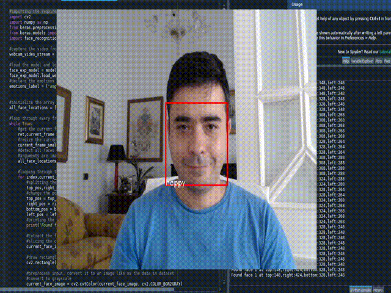
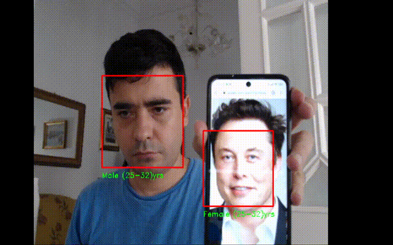
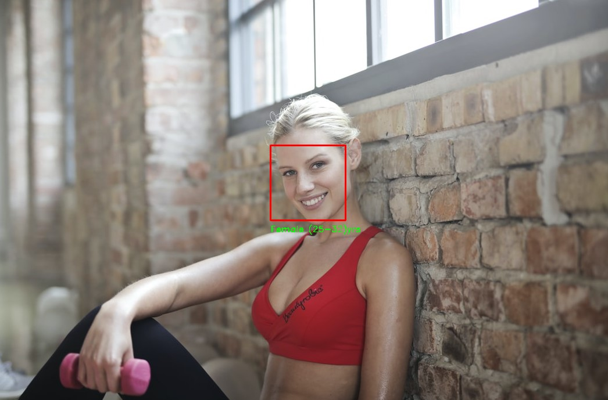

## Realtime Face Recognition

In this repo, I will show you how to install the face recognition library in python by using spyder and create your own machine learning program to detect your own face.

The library face-recognition recognize and manipulate faces from Python or from the command line with the world’s simplest face recognition library.

Built using [dlib](http://dlib.net/)’s state-of-the-art face recognition built with deep learning. The model has an accuracy of 99.38% on the [Labeled Faces in the Wild](http://vis-www.cs.umass.edu/lfw/) benchmark.

This also provides a simple `face_recognition` command line tool that lets

you do face recognition on a folder of images from the command line!

## Installation

The steps for installing OpenCV through Anaconda are pretty easy and straight forward.

Don’t forget to add Anaconda to your path, so you can easily access `conda `command from the prompt.

- Create a folder for your project where you will put your python scripts.
- Head to your folder through the command line `cd C:\Users\<username>\my_folder`, and activate the virtual environment you just created, with the following command:

### Create an anaconda environment

Open **Anaconda Prompt** from start menu and run the following code:

```
conda create --name face python=3.7 spyder=5
```

```
conda activate face
```

```
pip install opencv-python==4.2.0
```

```
pip install opencv-contrib-python
```

```
pip install cmake
```

download the file

```
wget dlib-19.19.0-cp37-cp37m-win_amd64.whl
```

```
pip install dlib-19.19.0-cp37-cp37m-win_amd64.whl --no-cache-dir
```



```
pip install face_recognition-1.3.0-py2.py3-none-any.whl
```

we launch the Spyder  application

```
spyder
```

```
import cv2
import dlib
import face_recognition

#printing versions
print(cv2.__version__)
print(dlib.__version__)
print(face_recognition.__version__)

```

And my output

```
4.2.0
19.19.0
1.2.3
```

Go to Tools -> Preferences

Click Ipython console in left tab

Click on Graphics on top  tab

Change Graphics Backend to 'Automatic'

Apply and OK

File restart

```
#loading the image to detect
image_test= cv2.imread('images/testing/trump-modi.jpg')

#showing the current image with title
cv2.imshow("Image",image_test)
```

Installing Tensorflow and Keras in Anaconda

Before installing Keras, install the backend engine Tensorflow

Close all open spyder or Navigator window

```
conda install tensorflow
```

```
conda install keras
```

```
pip install h5py==2.10.0  --user
```

###  Real time Face Detection


```
#importing the required libraries
import cv2
import face_recognition

#capture the video from default camera
webcam_video_stream = cv2.VideoCapture(1)

#initialize the array variable to hold all face locations in the frame
all_face_locations = []

#loop through every frame in the video
while True:
    #get the current frame from the video stream as an image
    ret,current_frame = webcam_video_stream.read()
    #resize the current frame to 1/4 size to proces faster
    current_frame_small = cv2.resize(current_frame,(0,0),fx=0.25,fy=0.25)
    #detect all faces in the image
    #arguments are image,no_of_times_to_upsample, model
    all_face_locations = face_recognition.face_locations(current_frame_small,number_of_times_to_upsample=2,model='hog')

    #looping through the face locations
    for index,current_face_location in enumerate(all_face_locations):
        #splitting the tuple to get the four position values of current face
        top_pos,right_pos,bottom_pos,left_pos = current_face_location
        #change the position maginitude to fit the actual size video frame
        top_pos = top_pos*4
        right_pos = right_pos*4
        bottom_pos = bottom_pos*4
        left_pos = left_pos*4
        #printing the location of current face
        print('Found face {} at top:{},right:{},bottom:{},left:{}'.format(index+1,top_pos,right_pos,bottom_pos,left_pos))
        #draw rectangle around the face detected
        cv2.rectangle(current_frame,(left_pos,top_pos),(right_pos,bottom_pos),(0,0,255),2)
    #showing the current face with rectangle drawn
    cv2.imshow("Webcam Video",current_frame)

    if cv2.waitKey(1) & 0xFF == ord('q'):
        break

#release the stream and cam
#close all opencv windows open
webcam_video_stream.release()
cv2.destroyAllWindows()
```

##  Real time Face Emotion




```
#importing the required libraries
import cv2
import numpy as np
from keras.preprocessing import image
from keras.models import model_from_json
import face_recognition

#capture the video from default camera
webcam_video_stream = cv2.VideoCapture(1)

#load the model and load the weights
face_exp_model = model_from_json(open("dataset/facial_expression_model_structure.json","r").read())
face_exp_model.load_weights('dataset/facial_expression_model_weights.h5')
#declare the emotions label
emotions_label = ('angry', 'disgust', 'fear', 'happy', 'sad', 'surprise', 'neutral')


#initialize the array variable to hold all face locations in the frame
all_face_locations = []

#loop through every frame in the video
while True:
    #get the current frame from the video stream as an image
    ret,current_frame = webcam_video_stream.read()
    #resize the current frame to 1/4 size to proces faster
    current_frame_small = cv2.resize(current_frame,(0,0),fx=0.25,fy=0.25)
    #detect all faces in the image
    #arguments are image,no_of_times_to_upsample, model
    all_face_locations = face_recognition.face_locations(current_frame_small,number_of_times_to_upsample=2,model='hog')

    #looping through the face locations
    for index,current_face_location in enumerate(all_face_locations):
        #splitting the tuple to get the four position values of current face
        top_pos,right_pos,bottom_pos,left_pos = current_face_location
        #change the position maginitude to fit the actual size video frame
        top_pos = top_pos*4
        right_pos = right_pos*4
        bottom_pos = bottom_pos*4
        left_pos = left_pos*4
        #printing the location of current face
        print('Found face {} at top:{},right:{},bottom:{},left:{}'.format(index+1,top_pos,right_pos,bottom_pos,left_pos))

        #Extract the face from the frame, blur it, paste it back to the frame
        #slicing the current face from main image
        current_face_image = current_frame[top_pos:bottom_pos,left_pos:right_pos]

        #draw rectangle around the face detected
        cv2.rectangle(current_frame,(left_pos,top_pos),(right_pos,bottom_pos),(0,0,255),2)

        #preprocess input, convert it to an image like as the data in dataset
        #convert to grayscale
        current_face_image = cv2.cvtColor(current_face_image, cv2.COLOR_BGR2GRAY)
        #resize to 48x48 px size
        current_face_image = cv2.resize(current_face_image, (48, 48))
        #convert the PIL image into a 3d numpy array
        img_pixels = image.img_to_array(current_face_image)
        #expand the shape of an array into single row multiple columns
        img_pixels = np.expand_dims(img_pixels, axis = 0)
        #pixels are in range of [0, 255]. normalize all pixels in scale of [0, 1]
        img_pixels /= 255

        #do prodiction using model, get the prediction values for all 7 expressions
        exp_predictions = face_exp_model.predict(img_pixels)
        #find max indexed prediction value (0 till 7)
        max_index = np.argmax(exp_predictions[0])
        #get corresponding lable from emotions_label
        emotion_label = emotions_label[max_index]

        #display the name as text in the image
        font = cv2.FONT_HERSHEY_DUPLEX
        cv2.putText(current_frame, emotion_label, (left_pos,bottom_pos), font, 0.5, (255,255,255),1)

    #showing the current face with rectangle drawn
    cv2.imshow("Webcam Video",current_frame)

    if cv2.waitKey(1) & 0xFF == ord('q'):
        break

#release the stream and cam
#close all opencv windows open
webcam_video_stream.release()
cv2.destroyAllWindows()        

```

## Realtime Age Detector




```

#importing the required libraries
import cv2
import face_recognition

#capture the video from default camera
webcam_video_stream = cv2.VideoCapture(1)

#initialize the array variable to hold all face locations in the frame
all_face_locations = []

#loop through every frame in the video
while True:
    #get the current frame from the video stream as an image
    ret,current_frame = webcam_video_stream.read()
    #resize the current frame to 1/4 size to proces faster
    current_frame_small = cv2.resize(current_frame,(0,0),fx=0.25,fy=0.25)
    #detect all faces in the image
    #arguments are image,no_of_times_to_upsample, model
    all_face_locations = face_recognition.face_locations(current_frame_small,number_of_times_to_upsample=2,model='hog')

    #looping through the face locations
    for index,current_face_location in enumerate(all_face_locations):
        #splitting the tuple to get the four position values of current face
        top_pos,right_pos,bottom_pos,left_pos = current_face_location
        #change the position maginitude to fit the actual size video frame
        top_pos = top_pos*4
        right_pos = right_pos*4
        bottom_pos = bottom_pos*4
        left_pos = left_pos*4
        #printing the location of current face
        #print('Found face {} at top:{},right:{},bottom:{},left:{}'.format(index+1,top_pos,right_pos,bottom_pos,left_pos))

        #Extract the face from the frame, blur it, paste it back to the frame
        #slicing the current face from main image
        current_face_image = current_frame[top_pos:bottom_pos,left_pos:right_pos]

        #The ‘AGE_GENDER_MODEL_MEAN_VALUES’ calculated by using the numpy. mean()        
        AGE_GENDER_MODEL_MEAN_VALUES = (78.4263377603, 87.7689143744, 114.895847746)
        #create blob of current flace slice
        #params image, scale, (size), (mean),RBSwap)
        current_face_image_blob = cv2.dnn.blobFromImage(current_face_image, 1, (227, 227), AGE_GENDER_MODEL_MEAN_VALUES, swapRB=False)

        # Predicting Gender
        #declaring the labels
        gender_label_list = ['Male', 'Female']
        #declaring the file paths
        gender_protext = "dataset/gender_deploy.prototxt"
        gender_caffemodel = "dataset/gender_net.caffemodel"
        #creating the model
        gender_cov_net = cv2.dnn.readNet(gender_caffemodel, gender_protext)
        #giving input to the model
        gender_cov_net.setInput(current_face_image_blob)
        #get the predictions from the model
        gender_predictions = gender_cov_net.forward()
        #find the max value of predictions index
        #pass index to label array and get the label text
        gender = gender_label_list[gender_predictions[0].argmax()]

        # Predicting Age
        #declaring the labels
        age_label_list = ['(0-2)', '(4-6)', '(8-12)', '(15-20)', '(25-32)', '(38-43)', '(48-53)', '(60-100)']
        #declaring the file paths
        age_protext = "dataset/age_deploy.prototxt"
        age_caffemodel = "dataset/age_net.caffemodel"
        #creating the model
        age_cov_net = cv2.dnn.readNet(age_caffemodel, age_protext)
        #giving input to the model
        age_cov_net.setInput(current_face_image_blob)
        #get the predictions from the model
        age_predictions = age_cov_net.forward()
        #find the max value of predictions index
        #pass index to label array and get the label text
        age = age_label_list[age_predictions[0].argmax()]

        #draw rectangle around the face detected
        cv2.rectangle(current_frame,(left_pos,top_pos),(right_pos,bottom_pos),(0,0,255),2)

        #display the name as text in the image
        font = cv2.FONT_HERSHEY_DUPLEX
        cv2.putText(current_frame, gender+" "+age+"yrs", (left_pos,bottom_pos+20), font, 0.5, (0,255,0),1)

    #showing the current face with rectangle drawn
    cv2.imshow("Webcam Video",current_frame)

    if cv2.waitKey(1) & 0xFF == ord('q'):
        break

#release the stream and cam
#close all opencv windows open
webcam_video_stream.release()
cv2.destroyAllWindows()        

```

## Realtime Face Detector


```
#importing the required libraries
import cv2
import face_recognition

#capture the video from default camera
webcam_video_stream = cv2.VideoCapture(1)

#load the sample images and get the 128 face embeddings from them
modi_image = face_recognition.load_image_file('images/samples/bezos.jpg')
modi_face_encodings = face_recognition.face_encodings(modi_image)[0]

trump_image = face_recognition.load_image_file('images/samples/musk.jpg')
trump_face_encodings = face_recognition.face_encodings(trump_image)[0]

ruslan_image = face_recognition.load_image_file('images/samples/ruslan.jpg')
ruslan_face_encodings = face_recognition.face_encodings(ruslan_image)[0]


#save the encodings and the corresponding labels in seperate arrays in the same order
known_face_encodings = [modi_face_encodings, trump_face_encodings, ruslan_face_encodings]
known_face_names = ["Bezos", "Musk", "Ruslan"]


#initialize the array variable to hold all face locations, encodings and names
all_face_locations = []
all_face_encodings = []
all_face_names = []

#loop through every frame in the video
while True:
    #get the current frame from the video stream as an image
    ret,current_frame = webcam_video_stream.read()
    #resize the current frame to 1/4 size to proces faster
    current_frame_small = cv2.resize(current_frame,(0,0),fx=0.25,fy=0.25)
    #detect all faces in the image
    #arguments are image,no_of_times_to_upsample, model
    all_face_locations = face_recognition.face_locations(current_frame_small,number_of_times_to_upsample=1,model='hog')

    #detect face encodings for all the faces detected
    all_face_encodings = face_recognition.face_encodings(current_frame_small,all_face_locations)


    #looping through the face locations and the face embeddings
    for current_face_location,current_face_encoding in zip(all_face_locations,all_face_encodings):
        #splitting the tuple to get the four position values of current face
        top_pos,right_pos,bottom_pos,left_pos = current_face_location

        #change the position maginitude to fit the actual size video frame
        top_pos = top_pos*4
        right_pos = right_pos*4
        bottom_pos = bottom_pos*4
        left_pos = left_pos*4

        #find all the matches and get the list of matches
        all_matches = face_recognition.compare_faces(known_face_encodings, current_face_encoding)

        #string to hold the label
        name_of_person = 'Unknown face'

        #check if the all_matches have at least one item
        #if yes, get the index number of face that is located in the first index of all_matches
        #get the name corresponding to the index number and save it in name_of_person
        if True in all_matches:
            first_match_index = all_matches.index(True)
            name_of_person = known_face_names[first_match_index]

        #draw rectangle around the face    
        cv2.rectangle(current_frame,(left_pos,top_pos),(right_pos,bottom_pos),(255,0,0),2)

        #display the name as text in the image
        font = cv2.FONT_HERSHEY_DUPLEX
        cv2.putText(current_frame, name_of_person, (left_pos,bottom_pos), font, 0.5, (255,255,255),1)

    #display the video
    cv2.imshow("Webcam Video",current_frame)

    if cv2.waitKey(1) & 0xFF == ord('q'):
        break

#release the stream and cam
#close all opencv windows open
webcam_video_stream.release()
cv2.destroyAllWindows()        
```


If you require a program that detect the faces in a single image which gives you the

gender and also the years.


## Image gender face detector




```
#importing the required libraries
import cv2
import face_recognition

#loading the image to detect
image_to_detect = cv2.imread('images/testing/girls.jpg')

#detect all faces in the image
#arguments are image,no_of_times_to_upsample, model
all_face_locations = face_recognition.face_locations(image_to_detect,model='hog')

#print the number of faces detected
print('There are {} no of faces in this image'.format(len(all_face_locations)))

#looping through the face locations
for index,current_face_location in enumerate(all_face_locations):
    #splitting the tuple to get the four position values of current face
    top_pos,right_pos,bottom_pos,left_pos = current_face_location
    #printing the location of current face
    print('Found face {} at top:{},right:{},bottom:{},left:{}'.format(index+1,top_pos,right_pos,bottom_pos,left_pos))
    #slicing the current face from main image
    current_face_image = image_to_detect[top_pos:bottom_pos,left_pos:right_pos]
    
    #The ‘AGE_GENDER_MODEL_MEAN_VALUES’ calculated by using the numpy. mean()        
    AGE_GENDER_MODEL_MEAN_VALUES = (78.4263377603, 87.7689143744, 114.895847746)
    #create blob of current flace slice
    #params image, scale, (size), (mean),RBSwap)
    current_face_image_blob = cv2.dnn.blobFromImage(current_face_image, 1, (227, 227), AGE_GENDER_MODEL_MEAN_VALUES, swapRB=False)
    
    # Predicting Gender
    #declaring the labels
    gender_label_list = ['Male', 'Female']
    #declaring the file paths
    gender_protext = "dataset/gender_deploy.prototxt"
    gender_caffemodel = "dataset/gender_net.caffemodel"
    #creating the model
    gender_cov_net = cv2.dnn.readNet(gender_caffemodel, gender_protext)
    #giving input to the model
    gender_cov_net.setInput(current_face_image_blob)
    #get the predictions from the model
    gender_predictions = gender_cov_net.forward()
    #find the max value of predictions index
    #pass index to label array and get the label text
    gender = gender_label_list[gender_predictions[0].argmax()]
    
    # Predicting Age
    #declaring the labels
    age_label_list = ['(0-2)', '(4-6)', '(8-12)', '(15-20)', '(25-32)', '(38-43)', '(48-53)', '(60-100)']
    #declaring the file paths
    age_protext = "dataset/age_deploy.prototxt"
    age_caffemodel = "dataset/age_net.caffemodel"
    #creating the model
    age_cov_net = cv2.dnn.readNet(age_caffemodel, age_protext)
    #giving input to the model
    age_cov_net.setInput(current_face_image_blob)
    #get the predictions from the model
    age_predictions = age_cov_net.forward()
    #find the max value of predictions index
    #pass index to label array and get the label text
    age = age_label_list[age_predictions[0].argmax()]
          
    #draw rectangle around the face detected
    cv2.rectangle(image_to_detect,(left_pos,top_pos),(right_pos,bottom_pos),(0,0,255),2)
        
    #display the name as text in the image
    font = cv2.FONT_HERSHEY_DUPLEX
    cv2.putText(image_to_detect, gender+" "+age+"yrs", (left_pos,bottom_pos+20), font, 0.5, (0,255,0),1)

cv2.imshow("Age and Gender",image_to_detect)
cv2.waitKey(0)
```


Thank you for your attention.
